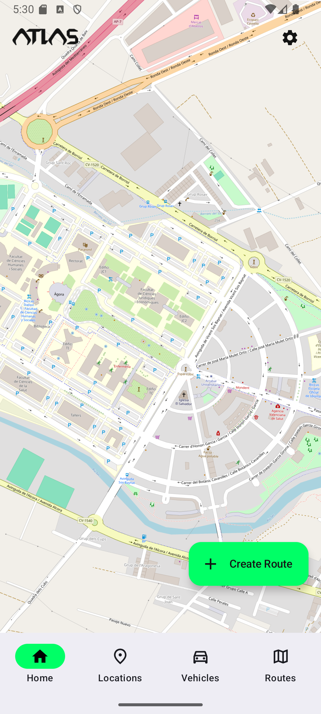
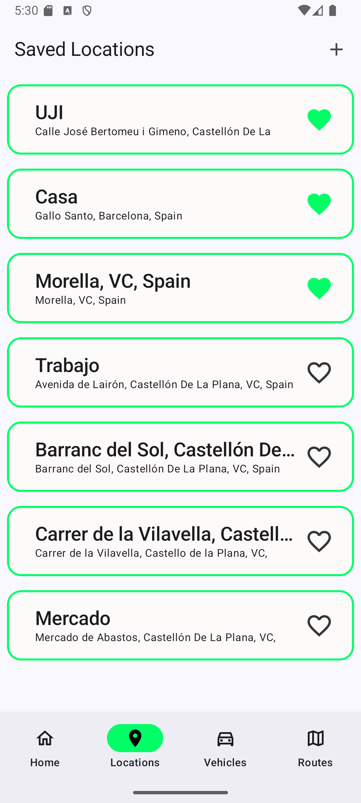
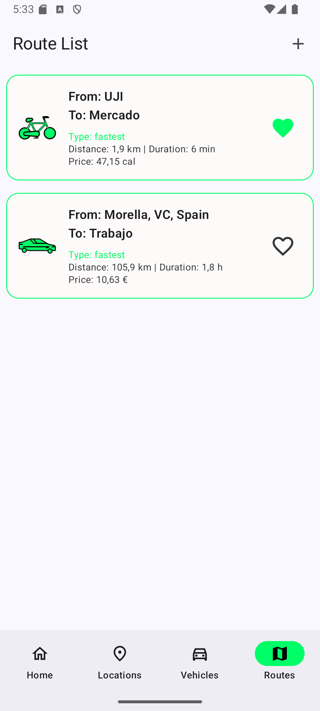

# Atlas

Atlas es una aplicación móvil Android diseñada para la gestión de rutas. Permite calcular la distancia y el coste de una ruta entre dos puntos, adaptándose a las necesidades del usuario al calcular los costos en calorías, electricidad o combustibles fósiles.

## Objetivo del Proyecto

Este proyecto fue desarrollado como parte de un trabajo universitario, pero tiene potencial para ser ampliado como una herramienta práctica para usuarios interesados en optimizar rutas según su impacto económico y energético.

## Tecnologías Utilizadas

- **Lenguaje**: Kotlin con Jetpack Compose.
- **Backend**: Firebase (Base de datos serverless).
- **APIs Externas**:
  - [OpenRouteService](https://openrouteservice.org) para localizaciones y rutas.
  - [Apidatos REE](https://apidatos.ree.es/) para precios de electricidad.
  - [Datos.gob.es](https://datos.gob.es) para precios de combustibles fósiles.
- **Librerías para realización de pruebas**:
  - JUnit4.
  - Mockito:
    - Core: `3.12.4`
    - Inline: `3.12.4`
    - Kotlin: `4.0.0`
- **Otras librerías**:
  - OpenRouteMap (Para mostrar los mapas y rutas)
  
## Diagrama de arquitectura


 
## Funcionalidades Principales

1. **Pantalla Principal**:
	

   - Selección de ubicaciones en el mapa mediante un toque prolongado.					
   - Guardado de ubicaciones con un alias o toponimia personalizada.
   - Menú desplegable para:
     - Alternar entre tema claro y oscuro.
     - Cambiar la contraseña.
     - Seleccionar el tipo de ruta preferido.
     - Cerrar sesión o eliminar la cuenta.

   
2. **Gestión de Ubicaciones**:
   - Listado de ubicaciones guardadas.
   - Crear, modificar y eliminar ubicaciones.

3. **Gestión de Vehículos**:
   - Vehículos predeterminados: a pie y bicicleta.
   - Adición de vehículos personalizados: coches eléctricos o fósiles, motos eléctricas o fósiles, patines eléctricos.
   - Editar o eliminar los vehiculos personalizados.

4. **Gestión de Rutas**:
   - Consulta de rutas guardadas con detalles de distancia, duración y coste.
   - Creación de rutas nuevas basadas en:
     - Dos ubicaciones.
     - Un vehículo específico.
     - Un tipo de ruta (más rápida, más barata o más corta).

5. **Favoritos**:
   - Marcado de localizaciones, rutas y vehículos como favoritos para priorizarlos en las listas.
   
**Pantallas de localizaciones y rutas**

<div style="display: flex; justify-content: space-between; align-items: center;">
  
  
</div>


## Instalación y Despliegue

1. Clonar el repositorio en tu máquina local:
   ```bash
   git clone https://github.com/DarkPunk2/Atlas 
   ```
   
2. Abrir el proyecto en Android Studio LadyBug 2024.2.1.

3. Compilar la actividad principal (main activity) y ejecutar el proyecto en un emulador o dispositivo físico.

##Equipo de desarrollo
- **Miembros**:
	- Alejandro Beltrán Salas (https://github.com/DarkPunk2)
	- Gillermo Gragera Cerrillos (https://github.com/G11-GC)
	- Oscar Boix Ripollés (https://github.com/OscarBoix)
	- Moisés Corrales Bosch (https://github.com/MoisesBosch02)
	
## Licencia

Este proyecto está licenciado bajo la [Creative Commons Attribution-NonCommercial-NoDerivs 4.0 International](https://creativecommons.org/licenses/by-nc-nd/4.0/). 
Puedes usar esta aplicación libremente para fines personales y educativos, pero no modificar ni redistribuir su código.


